# FuncHole 

FuncHole is an open-source, self-hosted serverless platform: create Functions, compose them into Flows, and expose those Flows as HTTP routes through a Gateway. A Flow can run backend logic (a Node.js Function) or serve a frontend directly (a pre-built static site), and the entire lifecycle - create, build, deploy, wire into a Flow, invoke, inspect - is reachable through an MCP server, so a coding agent can manage a FuncHole app on your behalf without ever touching the REST API by hand.


> Wireframe only. The image above is a product-direction screenshot, not the current shipped interface.

## Overview

FuncHole is shaped around a simple request model:

```text
https://<gateway-key>.<domain>/<path>
```

Example:

```text
https://gw1.example.com/orders
```

The hostname belongs to the gateway. A Flow's `path` under that gateway is one of three shapes:

* an exact path, e.g. `/orders`
* a path with one or more `:name` segments, matching any single segment there and capturing it (e.g. `/api/todos/:id` matches `/api/todos/42`, and the invoked Function receives it as `event.pathParameters.id`)
* a single trailing `/*` wildcard owning an entire subtree (e.g. `/app/*`) - typically used to serve a whole static frontend

## Current Status

As of September 20, 2026, the backend covers the full Function → Flow → Gateway lifecycle end to end, including a frontend deployment path and an MCP server for agent-driven management. It is still under active development; see "Not implemented yet" below for known gaps.

Implemented today:

* Spring Boot `controlplane` for management APIs
* raw Netty `gateway` for HTTPS ingress
* Flyway-managed PostgreSQL schema
* JWT-based authentication, plus dedicated `fh_mcp_...` API keys for MCP clients
* domain creation and TXT-based verification
* gateway creation under verified domains
* shared certificate module
* self-signed certificate generation for local development, real ACME/Let's Encrypt issuance and expiry-based renewal for production (HTTP-01 challenge, `CERTIFICATE_PROVIDER=LETS_ENCRYPT`)
* OpenBao-backed secret storage for certificate material and Function/Environment secrets
* in-memory gateway TLS + routing registry with short polling refresh
* Gateway routing with three shapes: exact-match, `:name` path-parameter capture, and `/*` wildcard subtree
* Invocation Registry with immutable dependency snapshot persistence
* NATS + JetStream `INVOCATION_READY` publication
* standalone `dispatcher` that plans and executes a Flow's **entire** step sequence (`FUNCTION`, `RESPONSE`, `MIDDLEWARE`, `SUB_FLOW`), passing each step's output to the next
* durable, idempotent `InvocationStepExecution` records (`READY`, attempt tracking) so JetStream redelivery cannot double-create execution intent
* standalone `runtime-registry` module: in-memory runtime capacity registration, compatibility filtering, and deterministic (least-in-flight) selection with reservation/release
* dispatcher selects and reserves runtime capacity via the Runtime Registry before ACK-ing an invocation
* standalone `runtime` Node.js execution worker, driven over IPC
* a Function build pipeline (submit source → build → publish artifact → deploy to `READY`) for two runtimes: `NODE` (runs your handler) and `STATIC` (serves a pre-built site's files directly through the Gateway, no code execution, for a frontend/UI - bypasses the Dispatcher entirely on the request path)
* S3-compatible artifact storage (RustFS locally), with a local filesystem cache on both the `runtime` and `gateway` sides
* shared Database and Environment resources, attachable to a Function or Flow, with env vars/secrets injected at invocation time
* an MCP server (`/api/mcp`) exposing Function/FunctionVersion/Flow/FlowVersion/Gateway/Domain/Database/Environment/Invocation management as tools - including a `get_flow_full_source` tool that returns a Flow's entire dependency tree (every step's Function source, `SUB_FLOW` steps expanded recursively) in one call
* `control-plane-web`: a Next.js UI for managing Functions, Flows, Gateways, and Databases by hand

Not implemented yet:

* durable/distributed runtime reservation (Runtime Registry state today is in-memory per dispatcher process only)
* artifact/source cache eviction or TTL
* DNS-01 ACME challenges (HTTP-01 is implemented - see `CERTIFICATE_PROVIDER=LETS_ENCRYPT` in [docs/environment-variables.md](docs/environment-variables.md) - but DNS-01 isn't, since it would mean picking a specific DNS provider's API to integrate with)
* automatic host-machine DNS setup for custom local domains
* a raw-body/custom-`Content-Type` response for a `NODE` Function's `RESPONSE` step - it always JSON-encodes `body` under `application/json` today, so real per-request dynamic HTML (true SSR) isn't supported yet; a static frontend should use the `STATIC` runtime instead
* combining a `:name` path parameter with a `/*` wildcard in the same route

## Why FuncHole

Most serverless platforms tightly couple deployment, routing, runtime behavior, and infrastructure ownership to a single provider.

FuncHole is exploring a different model:

* self-hosted
* gateway-first
* path-based function exposure under stable gateway hosts
* framework-independent shared modules where practical
* explicit boundaries between management, ingress, invocation, and runtime

## Architecture At A Glance

```text
Controlplane         -> owns auth, domains, gateways, certificates, flows, metadata
Gateway              -> resolves request host/path to the Flow that should be invoked
Invocation Registry  -> freezes the immutable Flow/dependency graph for one invocation
NATS + JetStream     -> coordinates distributed components globally
Invocation Dispatcher -> chooses the next executable step and requests runtime capacity
Runtime Registry     -> prepares/selects runtime and artifact capacity
IPC                  -> carries local hot-path execution messages
Runtime / Artifact   -> executes the selected component version
```

Architectural principle:

> Global coordination is event-driven; local execution is IPC-driven.

```mermaid
flowchart LR
    client["Client Request"]
    gateway["Gateway"]
    registry["Invocation Registry"]
    jetstream["NATS JetStream"]
    dispatcher["Invocation Dispatcher"]
    runtimeRegistry["Runtime Registry"]
    ipc["IPC"]
    runtime["Runtime / Artifact"]

    client --> gateway
    gateway -->|"Which Flow should this request invoke?"| registry
    registry -->|"Invocation ready: invocationId"| jetstream
    jetstream --> dispatcher
    dispatcher -->|"What executes next?"| runtimeRegistry
    runtimeRegistry -->|"Local execution target"| ipc
    ipc --> runtime
    runtime --> ipc
    ipc --> dispatcher
    dispatcher -->|"Completion state"| registry
    registry -->|"Invocation completed/failed"| jetstream
    jetstream -->|"Completion notification"| gateway
    gateway --> client
```



NATS + JetStream is the global coordination layer. JetStream is used for durable invocation lifecycle and state-transition events where delivery must survive consumer or service restarts, such as invocation ready, invocation completed, and invocation failed.

JetStream events should primarily identify the invocation, for example with an `invocationId`. The complete dependency graph should not be sent through JetStream. The Invocation Registry remains the durable source of truth for the immutable Flow version, dependency graph, pinned component versions, invocation status, and result state.

```text
Invocation Registry
        │
        │ invocationId
        ▼
   NATS JetStream
        │
        ▼
Invocation Dispatcher
        │
        │ load immutable invocation snapshot
        ▼
Invocation Registry
```

NATS + JetStream is not a replacement for IPC. IPC is not intended to become the global distributed communication mechanism. NATS + JetStream provides durable, decoupled global coordination between services and nodes. IPC remains the optimized local execution path between runtime-facing components and prepared runtimes/artifacts.

A `STATIC`-runtime Flow is the one exception to this whole pipeline: the Gateway detects it at routing time and serves the cached artifact's files directly, never creating an Invocation and never touching the Invocation Registry, NATS, or the Dispatcher.

Additional event schemas, NATS subjects, stream names, advanced consumer configuration, retention policies, retry counts, scheduling algorithms, and runtime persistence details are future design work. They are intentionally not decided by this README.

More detailed architecture notes live in [docs/architecture.md](docs/architecture.md).

## Repository Layout

```text
funchole/
├── artifact/
├── certificate/
├── control-plane-web/
├── controlplane/
├── core/
├── docker/
├── docs/
├── gateway/
├── invocation/
├── invocation-contract/
├── dispatcher/
├── runtime-registry/
├── runtime/
├── scripts/
├── Dockerfile
├── docker-compose.yml
├── docker-compose.dev.yml
└── image.png
```

## Modules

| Module | Responsibility |
| --- | --- |
| `artifact` | Storage-neutral contracts for a published Function artifact (publish, remote fetch, local cache) - shared by `controlplane` (publishing) and `runtime`/`gateway` (fetching) |
| `certificate` | Framework-independent certificate contracts, models, and generators |
| `control-plane-web` | Next.js UI for managing Functions, Flows, Gateways, and Databases |
| `controlplane` | Spring Boot management API, build pipeline, and the MCP server |
| `core` | Shared pagination, exception, response, and mapper concerns |
| `gateway` | Standalone raw Netty HTTPS ingress service - routes requests to a Flow, creates Invocations, or serves a `STATIC` Flow's files directly |
| `invocation` | Invocation persistence, immutable dependency snapshots, and ready-event publication |
| `invocation-contract` | Wire-level request/response types shared across the invocation path |
| `dispatcher` | Standalone JetStream consumer: validates the snapshot, plans and executes the Flow's full step sequence, persists durable step-execution intent, and requests runtime capacity |
| `runtime-registry` | In-memory runtime capacity registration, compatibility filtering, and deterministic selection/reservation |
| `runtime` | Standalone Node.js execution worker - fetches/caches the artifact and runs a Function's handler over IPC |

## Responsibility Summary

| Area | Question it answers |
| --- | --- |
| Gateway | Which Flow should this request invoke? |
| Invocation Registry | What exact immutable Flow/dependency graph belongs to this invocation? |
| Invocation Dispatcher | What executes next, what input does it require, and where should execution be scheduled? |
| Runtime Registry | Which runtime capacity is available and how should the required runtime/artifact be prepared? |
| NATS + JetStream | How distributed components coordinate globally. |
| IPC | How local runtime execution communicates efficiently. |

## Technology Stack

| Area | Technology |
| --- | --- |
| Language | Java 25 |
| Build | Gradle |
| Controlplane | Spring Boot 4.1.1 |
| Gateway | Raw Netty |
| Database | PostgreSQL 17 |
| Migration | Flyway |
| Secret management | OpenBao |
| Global coordination | NATS + JetStream |
| Authentication | Spring Security + JWT |
| API docs | Springdoc OpenAPI |
| Mapping | MapStruct |
| Logging | Log4j2 in `controlplane`, SLF4J Simple in `gateway` |
| Testing | JUnit + Testcontainers |
| Local infrastructure | Docker Compose |

## Quick Start

Recommended local development flow:

```bash
docker compose -f docker-compose.dev.yml up --build
```

Local service endpoints:

| Service | Address |
| --- | --- |
| Controlplane | `http://localhost:7080` |
| Control-plane web UI | `http://localhost:3000` |
| Gateway | `https://localhost` |
| PostgreSQL | `localhost:5432` |
| OpenBao | `http://localhost:8200` |
| NATS | `localhost:4222` |
| NATS monitoring | `http://localhost:8222` |
| RustFS S3 API | `http://localhost:9000` |
| RustFS Console | `http://localhost:9001` |
| Technitium DNS UI | `http://localhost:5380` |

Useful checks:

```bash
curl http://localhost:7080/actuator/health
curl http://localhost:7080/api/v1/system/ping
curl -k https://localhost/health
```

More setup and local workflow details live in [docs/development.md](docs/development.md).

## Managing FuncHole via MCP

The `controlplane` module runs an MCP server at `/api/mcp` (Streamable HTTP transport) exposing the full Function/FunctionVersion/Flow/FlowVersion/Gateway/Domain/Database/Environment/Invocation lifecycle as tools - the same operations available through the REST API, reachable by an MCP-capable client (Claude Code, opencode, Codex CLI, Puku, or any other MCP client) instead of hand-written HTTP calls.

Authenticate with a dedicated API key rather than a user's JWT:

```bash
curl -X POST http://localhost:7080/api/v1/auth/token \
  -H "Content-Type: application/json" \
  -d '{"username": "admin", "password": "admin12345"}'

curl -X POST http://localhost:7080/api/v1/api-keys \
  -H "Authorization: Bearer <token-from-above>" \
  -H "Content-Type: application/json" \
  -d '{"name": "my-agent"}'
```

The response's `rawKey` (prefixed `fh_mcp_...`) is shown once - use it as a bearer token when connecting an MCP client to `http://localhost:7080/api/mcp`.

**Claude Code:**

```bash
claude mcp add --transport http funchole http://localhost:7080/api/mcp \
  --header "Authorization: Bearer <fh_mcp_...>"
```

**opencode** (note the header syntax is `NAME=VALUE`, not `NAME: VALUE`):

```bash
opencode mcp add funchole --url http://localhost:7080/api/mcp \
  --header "Authorization=Bearer <fh_mcp_...>"
```

**Codex CLI** (reads the token from an environment variable rather than taking it inline):

```bash
export FUNCHOLE_MCP_TOKEN=<fh_mcp_...>
codex mcp add funchole --url http://localhost:7080/api/mcp \
  --bearer-token-env-var FUNCHOLE_MCP_TOKEN
```

A coding agent working through these tools can create a Function, submit its source, build and deploy it, wire it into a Flow, and adopt that Flow - end to end, without touching the REST API or a terminal. `get_flow_full_source` is the most agent-friendly read: it returns a Flow's entire dependency tree (every step's Function source inlined, `SUB_FLOW` steps expanded recursively) in a single call.

## Documentation

Project docs:

* [docs/architecture.md](docs/architecture.md)
* [docs/development.md](docs/development.md)
* [docs/environment-variables.md](docs/environment-variables.md) - every configuration knob for a production deployment
* [docs/limitations.md](docs/limitations.md) - known limitations, including why Gateway must run as exactly one instance
* [CONTRIBUTING.md](CONTRIBUTING.md)

## Community

Join the FuncHole Discord server: [https://discord.gg/yS8etyU7p](https://discord.gg/yS8etyU7p)

## Local Development Notes

Important current behavior:

* `gateway` starts after `controlplane` is healthy, because Flyway runs in `controlplane`
* `gateway` serves HTTPS on port `443` in development to keep the URL shape production-like
* development certificates are self-signed, so browser trust warnings are expected unless you trust the cert or issuing CA
* OpenBao now uses persistent local storage in Docker instead of in-memory dev mode
* `runtime` and `gateway` both read artifacts through the generic S3-compatible contract, with RustFS as the local backend
* `rustfs-init` seeds checked-in demo artifacts into RustFS before Runtime starts
* custom local domains still require the host machine to resolve them correctly

## Contribution

Please read [CONTRIBUTING.md](CONTRIBUTING.md) before making architectural or persistence-related changes.

## License

FuncHole is licensed under the [Apache License 2.0](LICENSE).

## Project Direction

The module direction:

```text
com.funchole.backend
├── controlplane
├── gateway
├── invocation
├── invocation-contract
├── dispatcher
├── runtime-registry
├── runtime
└── artifact
```

Flow execution and runtime orchestration are implemented end to end; current focus is broadening what a Function/Flow can do (see "Not implemented yet" above) and hardening the MCP-driven agent workflow.
